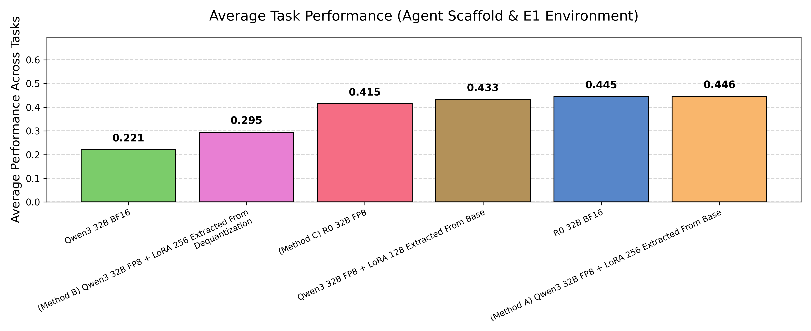

# Optimizing LLM Deployment via Cross-Precision Transfer
### A Case Study in Biomedical AI Agent Biomni

**Master's Thesis | Georg-August-Universität Göttingen | GWDG**

[](https://gitlab.gwdg.de/haldhah)
[]()
[](LICENSE)
[](https://www.python.org/downloads/)
[](https://developer.nvidia.com/cuda-toolkit)
[]()
[]()

## 📋 Table of Contents

- [Overview](#-overview)
- [Abstract](#-abstract)
- [Research Problem](#-research-problem)
- [Methodology](#-methodology)
  - [Baseline: Biomni-R0-32B (BF16)](#baseline-biomni-r0-32b-bf16)
  - [Method A: Naive Transfer (Recommended)](#method-a-naive-transfer-recommended)
  - [Method B: Corrective Extraction](#method-b-corrective-extraction)
  - [Method C: Direct Quantization](#method-c-direct-quantization)
- [Quantitative Results](#-quantitative-results)
- [Repository Structure](#-repository-structure)
- [Installation](#-installation)
- [Usage](#-usage)
- [Logs & Reproducibility](#-logs--reproducibility)
- [Citation](#-citation)
- [Acknowledgements](#-acknowledgements)

---

## 📖 Overview

This repository contains the complete implementation, experimental scripts, evaluation data, and results for the Master's Thesis **"Optimizing LLM Deployment via Cross-Precision Transfer"**.

Running Large Language Models (LLMs) in hardware-constrained settings often requires aggressive compression, such as 8-bit floating-point (FP8) quantization. However, domain-specific adaptations (like the **Biomni** biomedical agent built on top of Qwen3-32B) are typically trained in high precision (BF16).

This research investigates **Cross-Precision Transfer**: Can high-precision LoRA adapters be successfully "transplanted" onto FP8 base models without retraining?

## 📄 Abstract

The study validates the **Orthogonality Hypothesis**: the observation that quantization noise (high-rank, isotropic) is geometrically orthogonal to the semantic information encoded in LoRA (low-rank, structured).

We demonstrate that a naive transfer of BF16 adapters onto an FP8 base model achieves **statistical parity with the full-precision baseline** on the **Eval1** biomedical benchmark, enabling resource-efficient deployment on shared infrastructure (e.g., vLLM multi-adapter serving) without additional GPU costs.

> **Key Finding:** We observed a near-zero cosine similarity ($\approx -0.00001$) between the LoRA adapter vector and the quantization noise vector across all model layers.

## 🔬 Research Problem

Large language models fine-tuned for biomedical domains (like Biomni-R0-32B) require significant computational resources:

- **Memory**: 64GB for BF16 weights
- **Hardware**: Multiple high-end GPUs
- **Deployment Cost**: Expensive cloud infrastructure

**Key Question**: Can we achieve comparable performance with ~37.5% memory reduction through FP8 quantization and cross-precision adapter transfer?

| Method | Approach | Memory (VRAM) | Key Innovation |
|--------|----------|---------------|----------------|
| **Baseline** | BF16 Full Precision | 64.0 GB | Gold standard reference |
| **Method A** | Naive Transfer | 40.0 GB | LoRA extraction from BF16 weight differences |
| **Method B** | Corrective Extraction | 40.0 GB | Dequantization + error-correcting LoRA |
| **Method C** | Direct Quantization | 32.0 GB | Domain-calibrated FP8 quantization |

---

## 📊 Methodology

### Baseline: Biomni-R0-32B (BF16)

The **Biomni-R0-32B** model serves as our gold standard reference. It is a domain-adapted version of Qwen3-32B fine-tuned by the [Biomni Project at Stanford University](https://github.com/snap-stanford/Biomni) for biomedical reasoning tasks including:

- CRISPR delivery mechanism questions
- Genetic variant interpretation and prioritization
- Genome-wide association studies (GWAS) causal gene identification
- Laboratory biology database question answering
- Sequence analysis and interpretation
- Patient gene detection from clinical data
- Rare disease diagnosis
- Functional screening gene retrieval

### Method A: Naive Transfer (Recommended)

**Hypothesis**: Quantization noise is orthogonal to semantic adaptation in weight space.

**Concept**: Extract the LoRA adapter in BF16 from the fine-tuned model and apply it directly to the FP8-quantized base model.

**Mathematical Formulation**:
```
L_bio = W^{BF16}_biomni - W^{BF16}_qwen     (Weight difference)
L_bio ≈ B · A                                (Low-rank decomposition, rank=256)
W_final = W^{FP8}_qwen + B · A               (Apply LoRA to FP8 base)
```

**Result**: ✅ **Success.** The adapter works seamlessly because the quantization noise does not interfere with the semantic adaptation signal.

**Implementation**: See [`brain_surgery/LoRA_extraction/`](brain_surgery/LoRA_extraction/)

### Method B: Corrective Extraction

**Hypothesis**: A rank-256 adapter can encode both semantic adaptation AND quantization correction.

**Concept**: Extract a LoRA adapter from the difference between the BF16 model and the *dequantized* FP8 weights, attempting to "correct" quantization errors.

**Mathematical Formulation**:
```
L_corrective = W^{BF16}_biomni - Dequant(W^{FP8}_qwen)
L_corrective = ΔW_semantic - N_quant         (Combined difference)
W_final = W^{FP8}_qwen + B · A               (Apply corrective LoRA)
```

**Key Innovation**: Custom dequantization pipeline with Block-128 scale expansion:

```python
def dequantize_layer(weight_fp8, scale_inv):
    """Dequantize a single layer using Block-128 scheme."""
    scale_expanded = expand_scale(scale_inv, weight_fp8.shape)
    weight_float = weight_fp8.to(torch.float32)
    weight_dequant = weight_float * scale_expanded
    return weight_dequant.to(torch.bfloat16)
```

**Result**: ❌ **Failure.** The rank-limited adapter cannot capture high-rank quantization noise, leading to capacity saturation and performance degradation.

**Implementation**: See [`brain_surgery/dequantize_FP8/`](brain_surgery/dequantize_FP8/)

### Method C: Direct Quantization

**Hypothesis**: Domain-specific calibration data produces better quantization scales.

**Concept**: Directly quantize the fully fine-tuned biomedical model to FP8 (Block-128) using domain-specific calibration.

**Key Configuration**:
- **Format**: FP8 E4M3 with Block-128 quantization
- **Calibration**: 123 full-context instances, 3,163,274 tokens total
- **Average Context**: 25,718 tokens (up to 75,508 tokens)
- **Sampling**: Stratified across all 10 Eval1 biomedical tasks

**Result**: ⚠️ **Partial Success.** Performs well, but slightly worse than Method A due to quantization loss in the semantic weights.

**Implementation**: See [`quantization/scripts/FP8_quantization/`](quantization/scripts/FP8_quantization/)

---

## 📈 Quantitative Results

Evaluated on **Eval1** (433 questions across CRISPR, GWAS, Lab Bench, Patient Gene Detection, Rare Disease Diagnosis, and Screening Gene Retrieval). Method A reduces memory footprint by ~37.5% while matching baseline accuracy.

| Model Configuration | Method | Accuracy | Retention | VRAM Size |
| :--- | :--- | :--- | :--- | :--- |
| **Biomni-R0-32B (BF16)** | **Baseline** | **44.5%** | **100.0%** | **64.0 GB** |
| **Qwen3-FP8 + LoRA 256** | **Method A** | **44.6%** | **100.2%** | **40.0 GB** |
| Qwen3-FP8 + LoRA (Corrective) | Method B | 29.5% | 66.3% | 40.0 GB |
| R0-FP8 (Direct Quantization) | Method C | 41.4% | 93.0% | 32.0 GB |
| Qwen3-BF16 (No Adaptation) | Reference | 22.1% | 49.7% | 64.0 GB |

### Performance Heatmap


### Per-Task Accuracy



Detailed results with per-task breakdowns are available in [`thesis_results_final/`](thesis_results_final/).

---

## 📁 Repository Structure

```
Biomni/
├── 📂 biomni/                          # Core Biomni agent framework
│   ├── agent/
│   │   ├── c1.py                       # Main agent implementation (LangGraph-based)
│   │   ├── d1.py                       # Extended agent variant
│   │   └── e1.py                       # Full environment agent
│   ├── llm.py                          # LLM provider integrations
│   ├── tool/                           # Bioinformatics tool registry
│   └── eval/                           # Evaluation utilities
│
├── 📂 biomni_env/                      # Environment setup scripts
│   ├── README.md                       # Installation instructions
│   ├── setup.sh                        # Full environment setup (>10 hours)
│   ├── environment.yml                 # Conda environment specification
│   └── biomni_tools/                   # Pre-installed bioinformatics tools
│
├── 📂 brain_surgery/                   # Methods A & B: LoRA extraction & dequantization
│   ├── README.md                       # Detailed documentation
│   ├── dequantize_FP8/                 # FP8 → BF16 dequantization (Method B)
│   │   ├── dequant_FP8_to_BF16.py      # Main dequantization script
│   │   └── cpu_autopsy_*.py            # Sanity check on dequantized weights
│   ├── dequantize_INT4/                # INT4 → BF16 dequantization (exploratory)
│   │   ├── raw_dequantize_INT4.py      # AWQ INT4 unpacking + BF16 conversion
│   │   └── generate_plots.py           # Magnitude & orthogonality analysis plots
│   ├── LoRA_extraction/                # LoRA extraction via MergeKit
│   │   ├── extract_lora_256.sh         # SLURM batch script for extraction
│   │   └── sanitize_lora.py            # Sanitize LoRA for vLLM compatibility
│   ├── model_probing/                  # Weight tensor inspection tools
│   └── orthogonality_hypothesis/       # Quantization noise orthogonality analysis
│       ├── prove_orthagonality_all_layers.py
│       └── compare_noise_patterns.py
│
├── 📂 quantization/                    # Method C: Direct FP8 quantization
│   ├── README.md                       # Detailed documentation
│   ├── calibration_data/               # Biomedical calibration dataset (123 samples)
│   │   ├── calibration_data.json       # Final calibration dataset
│   │   ├── calibration_preview.txt     # Dataset statistics & sample preview
│   │   ├── Data_r0_annotated_cleaned.jsonl  # Cleaned source data
│   │   ├── prepare_calibration.py      # Data preparation script
│   │   └── clean_calibration_data.py   # Data cleaning script
│   └── scripts/
│       ├── FP8_quantization/           # FP8 E4M3 quantization (LLM Compressor)
│       │   ├── quantize_FP8.py         # Main quantization script
│       │   └── quanitze_FP8.sh         # SLURM batch launcher
│       └── INT4_quantization/          # AWQ INT4 quantization (exploratory)
│           ├── quantize_AWQ_INT4.py    # Main AWQ quantization script
│           └── quanitze_INT4.sh        # SLURM batch launcher
│
├── 📂 models_and_adapters/             # Quantized models & extracted LoRA adapters
│   ├── Biomni-R0-32B-AWQ-INT4-CustomCalib/   # AWQ INT4 quantized model
│   ├── Biomni-R0-32B-FP8-CustomCalib/        # FP8 quantized model (Method C)
│   ├── Biomni-R0-32B-From-INT4-Bridge-BF16/  # Dequantized INT4 → BF16 bridge model
│   ├── Qwen3-32B-FP8-to-BF16/                # Dequantized FP8 → BF16 bridge model
│   └── LoRa_extraction_results/               # Extracted LoRA adapters
│       ├── Method_A_lora_basic_original_base_rank_128/   # Method A, rank 128
│       ├── Method_A_lora_basic_original_base_rank_256/   # Method A, rank 256
│       └── Method_B_dequantized_corrected_lora_rank_256/ # Method B, rank 256
│
├── 📂 server_client_code/              # Model inference infrastructure
│   ├── README.md                       # Server setup documentation
│   ├── run_server.sh                   # vLLM server launch script (multi-GPU)
│   ├── run_client.sh                   # Evaluation client launcher
│   ├── run_client_Eval1_benchmark.py   # Eval1 benchmark evaluation client
│   ├── load_balancer.py                # Multi-GPU load balancer
│   └── diagnose_servers.sh             # Server health diagnostics
│
├── 📂 thesis_results_final/            # Experimental results (all methods)
│   ├── annotation_pipeline/            # Human/AI annotation tools
│   │   ├── 1_extract_answers.py        # Step 1: Extract answers from model outputs
│   │   ├── 2_ask_chat.py              # Step 2: AI-assisted evaluation
│   │   ├── 3_create_final_annotated_results.py  # Step 3: Create annotated results
│   │   └── 4_create_final_statistics.py         # Step 4: Generate statistics
│   ├── R0_32B_BF16/                    # Baseline results
│   ├── Qwen_FP8_LORA256/              # Method A results
│   ├── Qwen_FP8_with_extracted_dequantized_LORA_rank256/  # Method B results
│   ├── R0-32B-FP8/                     # Method C results
│   ├── Qwen_32B_base_model/            # Qwen3-BF16 reference (no adaptation)
│   └── R0_32B_INT8_quantized/          # INT8 quantization (exploratory)
│
├── 📂 visualization/                   # Result visualization
│   ├── README.md                       # Visualization documentation
│   ├── bar_chart.py                    # Per-task accuracy bar chart generator
│   ├── heatmap.py                      # Cross-model performance heatmap generator
│   ├── bar_chart.png                   # Generated bar chart
│   ├── heatmap.png                     # Generated heatmap
│   └── *.json                          # Statistics data files (per method)
│
├── 📂 logs/                            # Execution logs (reproducibility)
│   └── README.md                       # Log file documentation
│
└── 📂 miscellaneous/                   # Supplementary experiments & SFT
    ├── R0/                             # Model comparison & fine-tuning scripts
    └── eval_output/                    # Raw evaluation outputs
```

---

## 🚀 Installation

### Prerequisites

- **Python**: 3.10+
- **CUDA**: 12.1+
- **GPU**: NVIDIA H100 (80GB) recommended; 4× GPUs for inference
- **Disk**: 100GB+ for models and environments

### Step 1: Clone the Repository

```bash
git clone https://gitlab.gwdg.de/haldhah/cross-precision-llm-deployment-biomni.git
cd Biomni
```

### Step 2: Set Up the Biomni Environment

**Option A**: Basic environment (recommended for quick start)
```bash
cd biomni_env
conda env create -f environment.yml
conda activate biomni_e1
```

**Option B**: Full E1 environment (requires >10 hours and 30GB disk)
```bash
cd biomni_env
bash setup.sh
conda activate biomni_e1
```

### Step 3: Install Component-Specific Requirements

```bash
# For brain surgery (Methods A & B)
pip install -r brain_surgery/brain_surgery_requirments.txt

# For quantization (Method C)
pip install -r quantization/quantization_requirements.txt

# For server/inference
pip install -r server_client_code/requirements.txt

# For visualization
pip install -r visualization/requirements.txt

# For annotation pipeline
pip install -r thesis_results_final/annotation_pipeline/annotate_requirment.txt
```

### Step 4: Set Up Environment Variables

Create a `.env` file in the repository root:

```bash
# API Keys for AI-assisted evaluation
CUSTOM_MODEL_API_KEY=your_chat_ai_key

# Model paths (adjust to your setup)
MODEL_PATH=/path/to/models
```

---

## 💻 Usage

### 1. Extract LoRA (Method A — Recommended)

Extracts the difference between the fine-tuned Biomni model and the Qwen base model into a lightweight adapter:

```bash
cd brain_surgery/LoRA_extraction
sbatch extract_lora_256.sh
```

Or manually with MergeKit:

```bash
mergekit-extract-lora \
    --model "path/to/Biomni-R0-32B" \
    --base-model "path/to/Qwen3-32B" \
    --out-path "adapters/method_a" \
    --max-rank 256 \
    --device cuda \
    --no-lazy-unpickle
```

After extraction, sanitize for vLLM compatibility:

```bash
python sanitize_lora.py
```

### 2. Corrective Extraction (Method B)

```bash
# Step 1: Dequantize FP8 model
cd brain_surgery/dequantize_FP8
python dequant_FP8_to_BF16.py

# Step 2: Verify dequantization
python cpu_autopsy_dequantized_model_sanity_check.py

# Step 3: Extract LoRA using dequantized model as base
cd ../LoRA_extraction
bash extract_lora_256.sh --base dequantized

# Step 4: Sanitize LoRA for vLLM compatibility
python sanitize_lora.py
```

### 3. Direct Quantization (Method C)

Quantize the model to FP8 (E4M3) with Block-128 granularity using domain-specific calibration:

```bash
cd quantization/scripts/FP8_quantization
sbatch quanitze_FP8.sh   # SLURM cluster
# OR
python quantize_FP8.py    # Direct execution
```

### 4. vLLM Deployment

Deploy the FP8 base model and dynamically load the BF16 LoRA adapter:

```bash
cd server_client_code
bash run_server.sh --model qwen-fp8 --gpus 4
```

Or directly with vLLM:

```bash
python -m vllm.entrypoints.openai.api_server \
    --model Qwen/Qwen3-32B-FP8 \
    --enable-lora \
    --lora-modules biomni=adapters/method_a
```

### 5. Run Evaluation

```bash
cd server_client_code
bash run_client.sh --benchmark eval1
```

### 6. Annotation Pipeline

```bash
cd thesis_results_final/annotation_pipeline

# Step 1: Extract answers from model outputs
python 1_extract_answers.py

# Step 2: AI-assisted evaluation
python 2_ask_chat.py

# Step 3: Create annotated results
python 3_create_final_annotated_results.py

# Step 4: Generate statistics
python 4_create_final_statistics.py
```

---

## 🛠️ Requirements

The experiments were conducted using the following versions. Reproducibility depends on specific versions of `vllm` and `mergekit`.

| Package | Version | Role |
|---------|---------|------|
| Python | 3.10+ | Runtime |
| vLLM | 0.5.4 | Multi-adapter FP8 inference serving |
| MergeKit | 0.4.2 | LoRA extraction from weight differences |
| llm-compressor | 0.2.0 | Method C (FP8/INT4 quantization) |
| PyTorch | 2.3.0 | Deep learning framework |
| CUDA | 12.1 | GPU acceleration |
| PEFT | latest | LoRA adapter loading |

---

## 📋 Logs & Reproducibility

All execution logs are preserved to ensure reproducibility:

| Log File | Purpose |
|----------|---------|
| `brain_surgery/dequantize_FP8/dequant_FP8.log` | FP8 dequantization process |
| `brain_surgery/dequantize_INT4/raw_dequant_*.log` | INT4 dequantization process |
| `quantization/scripts/FP8_quantization/quantize_FP8.log` | Method C FP8 quantization |
| `quantization/scripts/INT4_quantization/quantize_INT4.log` | INT4 AWQ quantization |
| `server_client_code/vllm_gpu*.log` | vLLM inference server logs |
| `server_client_code/load_balancer.log` | Multi-GPU load distribution |

See [`logs/README.md`](logs/README.md) for detailed log descriptions.

---

## 📚 Citation

If you reference this work, please cite the Master's Thesis as follows:

```bibtex
@mastersthesis{aldhahi2026optimizing,
  title={Optimizing LLM Deployment via Cross-Precision Transfer: A Case Study in Biomedical AI Agent Biomni},
  author={Aldhahi, Hasan Marwan Mahmood},
  school={Georg-August-Universit{\"a}t G{\"o}ttingen},
  year={2026},
  month={February},
  type={Master's Thesis},
  note={Supervised by Prof. Julian Kunkel and Dr. Narges Lux}
}
```

---

## 🙏 Acknowledgements

I thank my supervisors, **Prof. Julian Kunkel** and **Dr. Narges Lux**, for their support and guidance.

Special thanks to:
- **GWDG** and **KISSKI** for providing the HPC infrastructure
- The **Biomni Project** (Stanford University) for the baseline model and framework
- The open-source community behind **vLLM**, **MergeKit**, and **LLM Compressor**

---

## 📄 License

This project is licensed under the Apache License 2.0 — see the [LICENSE](LICENSE) file for details.

The Biomni framework is licensed separately by Stanford University.
